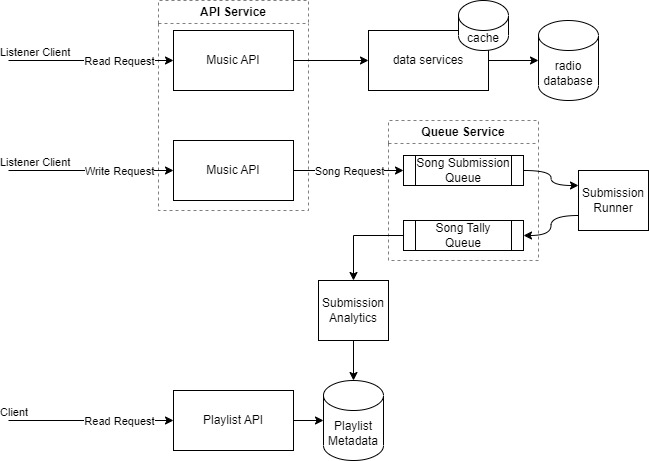
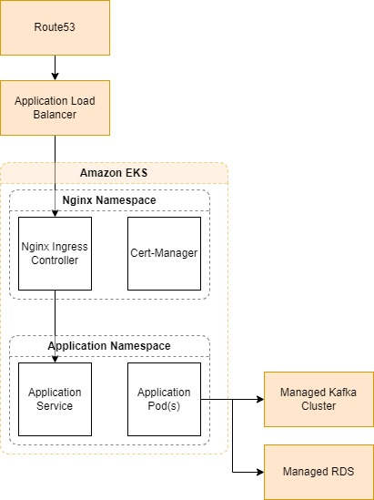

# service-music-api
Demo: Developing an available and scalable radio station song request API.

## About the Application and its Requirements
An API service that will provide details for the latest songs played on a regional radio station. The service will allow listeners to get details of the songs played, when they were played and submit song requests based on available songs. Song submissions will be processed (tallied) asynchronously and periodically, the top requested song will be queued into radio's playlist. (This top can be computed based on the number of tuned in listeners & song title requested). The current Submitted song request can form some kind of base playlist.

**Technology requirements:**
- Python 3.11+
    - Flask application with sqlalchemy
    - See [requirements.txt](./requirements.txt)
- Postgres for relation data storage
- Kafka with topic to manage song submission events (compacted logs)
- Docker for services
- Kubernetes for orchestrating Docker images of services
- AWS for managed services of the above technologies
    - AWS Aurora or RDS with Postgres Engine
    - AWS Manage Apache Kafka
    - AWS Elastic Container Registry (Docker image hosting)
    - AWS ECS or EKS
    - AWS S3 for object media storage
- GitHub Actions for pipeline automation
    - Helm (if deploying to EKS)
- Terraform for provisioning AWS resources

**Functional requirements:** 
- Be able to list/find songs being played
- Be able to see details of a song
- Submit a song request for playlist

**Non-functional requirements:**  
*Notes: Assumption made that our most important customers are those that tune in during radio station hours.*
- It is important from a customer experience POV that they are always able to find songs and request songs.
    - Maybe because it is a new tune they've discovered
    - Or rediscovering a song they've forgotten
    - Should be highly available for the duration of the early morning to late at night (99.9 uptime). Expect much less listeners overnight; therefore availability is not as important (maybe 99. uptime is acceptable?)
- It is important that we always have songs to play, therefore it is very important that our playlist is available and durable.
- Playlist submissions and the algorithm that goes into selecting songs is hidden from the users, therefore the durability is not as important. If anything is missing or inconsistency occurs, we can always preload a default playlist based on analytics. Availability is important because we want to ensure that listener submissions are successful.

**Metrics to Consider**  
Key metrics that we want to make sure we capture are:
- Good (200) Read/Write Latency in Percentiles: To ensure that X PERCENTAGE of our requests are under an average response rate (ms)
- Bad (500) Read/Write Latency in Percentiles
- Number of Reads/Write requests to endpoints: For understanding the demand and possible peak hours.
- Number of failed Reads/Write requests to endpoints (500s): Possible indicator for issues.
- Service resource utilization for CPU, memory, and IO

## Application Infrastructure
*Notes: Assumption that VPC and proper subnetting & security groups are already in place. Expect to have a user role with the proper IAM policies to be allowed to push images to ECR and configure ECS or deploy to EKS.*

Traffic from listeners will be region based routed via **Route53** to an **Application Load Balancer** (ALB).  

- With **Elastic Container Service** (ECS), ALB will have provisioned certificates from **AWS Certificate Manager** which will handle TLS Termination.

- With EKS, ALB will forward traffic to Kubernetes Ingress controller (probably Nginx) where TLS termination will occur with managed certificates from the cert-manager service. 

Our application services will be built into images via Dockerfiles and published to **Elastic Container Registry**. This will be managed by a CI automation pipeline workflow which would encompass all necessary testing, building, validating and tagging stages 

Since both ECS and EKS are orchestrating our containered service(s), they will choose the appropriate worker nodes that have the sufficient resources to meet my deployment requirements. Some resource considerations, we need to ensure our worker nodes can support our maximum replica count (for autoScaling) + 1 or 2 extra replicas (to support RollingUpdate). Our Orchestrator's data planes will be provisioned in separate Availability Zones (AZ) to ensure regional availability of the application.

For persistent data, Postgres via **AWS Aurora** or **AWS RDS** (with Postgres Engine) supports multi AZ deployments to match our availability needs. Postgres' topology: 1 Primary (write/some reads) with 2 secondary nodes (reads) with streaming replication enabled. Similar setup would occur with Managed Kafka Cluster (Minimum 3 broker node setup). As durability is not as important, full ACK replication grantee on publish to all broker topics is probably not necessary but available to toggle (trade-off for client response performance).

All AWS managed services will be deployed via Terraform according to AWS provider documentation. If deploying to EKS, Helm charts will be created to deploy and configuration application services. Otherwise, Python scripts with AWS' Boto3 client to automate AWS-CLI requirements.

Additionally, application secret management could be off-loaded to services such as Hashicorp Vault or the like. Offers application base access, and automatic secret lifecycle management. 

At the platform level, AWS Managed services comes with **Cloudwatch** monitoring for centralized metrics and logs. At the application level, can build our own centralize logging and metrics collections with Elastic Stack (ELK) for centralized logging and Prometheus & Grafana for Metrics Dashboards respectively. Since our application is distributed, OpenTracing with OpenTelemetry & Jaeger would be useful to understand the request profile and runtime as it travels through the various services.

At the platform level, with managed services implemented, we have a few assurances of uptime. At the application level, identifying a proper replica count for each of our application services in our helm chart configuration to ensure that it can with stand traffic demands.

## Application Insights
With EKS as our Platform, we can leverage CloudWatch for both monitoring and logging of the platform services, data services and application containers (with Container Insights).  
From an EKS perspective, it is important to have a good overview of your clusters (control and data planes) overall health. Cluster health is important as it is also orchestrating your applications overall availability and health. Some important cluster metrics to dashboard are:
- Control Plane:
    - API Server request latencies
    - API Server request counts (Number of Requests)
    - API Server request capacity
    - Scheduling service duration (latency to complete scheduling)
    - Etcd Cluster services health (could prompt networking failures)
- Data Plane:
    - Worker Node resource capacity for resources like: CPU, MEMORY, and storage (low availability means unable to schedule)
    - Worker Node Pod/Container counts (visually observe any deployment imbalances)
    - Worker Node runtime Latency (observe if workers are having difficulty completing container runtimes when asked to schedule.)
- Application:
    - Pod request latencies & number of requests
    - Pod resource utilization (CPU and memory quotas)

Cloudwatch Alarms can be set on metrics such as resource capacity and/or node deployment imbalances. Alarms would trigger lambda rules to invoke automation script such as:
- Adding new a new node and/or rescheduling deployment across all available nodes
- draining (possibly bad node) and replace with new node (+ rescheduling deployments.)  

Cloudwatch Alarms set on control plane, like Etcd metrics, would likely be triggering team alerts. Due to the importance and statefulness of Etcd service, further investigation and involvement could be required to identify the issue.  
High percentage of Pod request latencies, resource utilization, error rates and degrading pod health could be an indication that our current replicaCount (& maxReplicaCount) is no longer suffice, and alerting the team for Helm Chart changes is needed (automating the relicaCount will not persist with the next chart deployment). Regularly profiling the application services to ensure that proper replicaCounts, autoScaling and affinity rules parameters still meet requirements is important to ongoing maintenance (Could be included as part of some load/performance testing suite based on metrics describing application popularity).

## Application Deployment Lifecycle
*Notes: With the assumption that database schema changes are already managed and dealt with ahead of time. Will only be considering application deployment lifecycle.*

Since our application is packaged as Docker images, all major version changes to runtime and dependency libraries can be updated via the Dockerfile. Our CI automation pipeline will manage versioning With tags (publish new tagged images to Container Registry).

**From Code to Production**  
*Notes: With assumptions that proper source code lifecycle management standards are used. Will employ basic Github Branching model workflow*

Rolling new changes (major or minor features)
- Branch from main with latest source and commit feature changes. (Run any localized testing, validations)
    - Any pushed commits to branch will run a subset of CI pipeline stages
- When ready, submit code changes from branch to main with Pull Request (PR).
    - CI pipeline stages will run in parallel while peer review of PR is occurring.
- Accepting PR and merging changes
    - Additional CI pipeline stages are included like testing (integrations, performance, etc...), validations and gating requirements.
    - Tagging and publishing images and artifacts will commence after all prior stages have passed.

*Notes: For continuous delivery, the next steps would involve human gating requirements to trigger the deployment stages. Otherwise, for continuous deployment, deployment stages will automatically occur. Will assume the latter. Will also assume EKS with Helm charts as deployment destination.*
- Helm charts with latest revision tags, from above steps, will deploy our application services to EKS.
    - Use RollingUpdate strategy to ensure that our new service pods are available/healthy before winding down previous pods.
    - Will specify a replica count for our services to be at least 3 to meet availability requirements
    - Can set minimum and maximum replica counts to support peaks and troughs in traffic demands (autoScaling).
    - As our applications are mainly stateless services, general deployment yaml will be sufficient.

Metrics that are monitored to ensure a healthy deployment.
- Automation failure codes
- Pod Health and availability
- Pod resource utilization percentages
- Application request latency
- Application request Error rates
- Application transaction errors to database
- Application client errors to queue services
- Queue/Database resource utilization percentages

If any issues occur with 1 or more of these potential metrics, look into executing automated rollback strategies (Rolling back to previous Helm Chart revision).

With EKS orchestrating our application services with RollingUpdate strategy, there should not be any maintenance window required.

**Additional**  
This deployment strategy can be rehearsed with automation to Dev, test and/or stage environments. Additional test and validations can be applied to tune metrics based on application changes. With Helm charts, we have the options of choosing to employ a gitops style of deployment with ArgoCD. Instead of pushing chart changes, ArgoCD services, will automatically pull chart changes from Repo base on code commit.